ЛР5

Роботу виконали студенти групи ІО-02:
- Воловик Олександр
- Литвиненко Данило
- Шумельчук Юрій

Варіант 16:
><b>Тема:</b> Оренда квартир
 <b>Сутності:</b> Квартира, параметри квартири, опис
 <b>Актори:</b> Хазяїн квартири, клієнт 
 <b>Сценарії використання:</b> 
 Хазяїн квартири: Створення/редагування/видалення інформації про квартиру
 Клієнт: пошук квартири по параметрам

Тестування розробленого API на відповідність опису у документації за допомогою Postman:

GET /api/orders

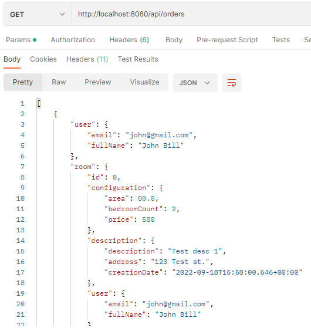

GET /api/rooms (Фільтрація по параметрах та пагінація)

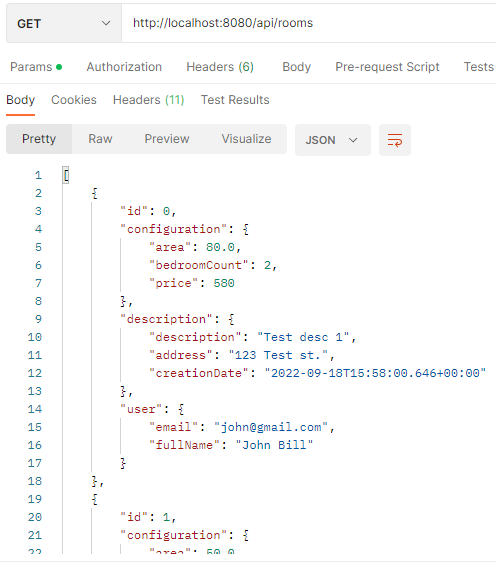
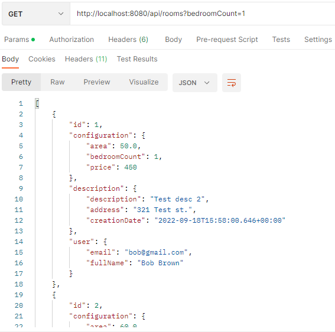
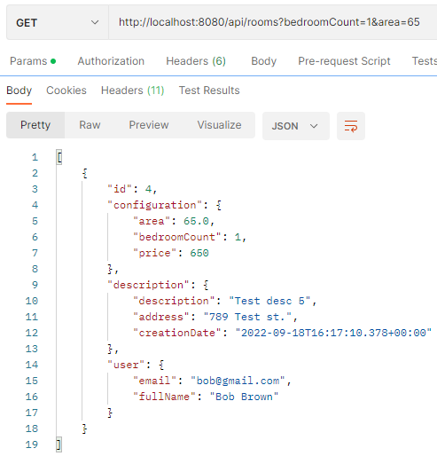
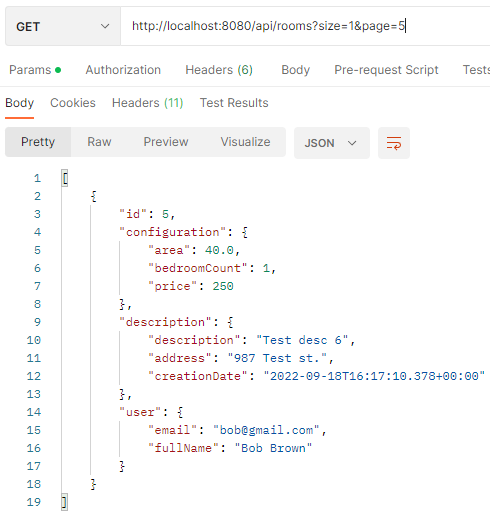

POST /api/rooms

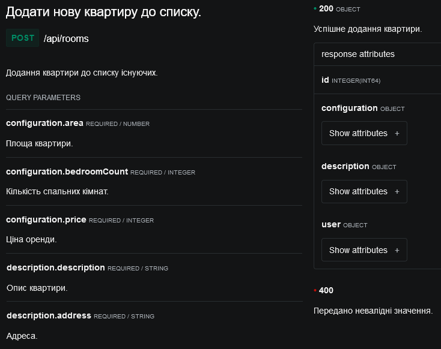
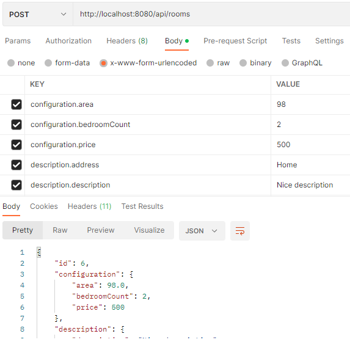
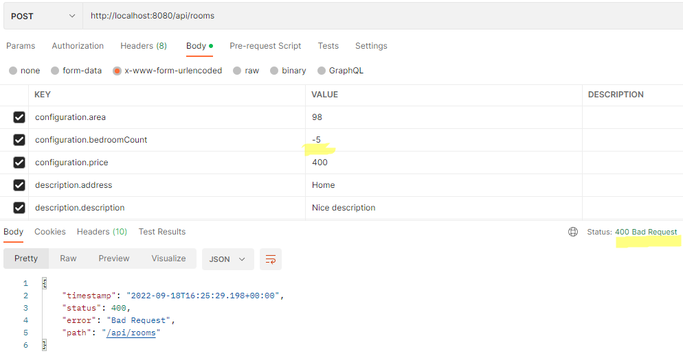

GET /api/rooms/{id}

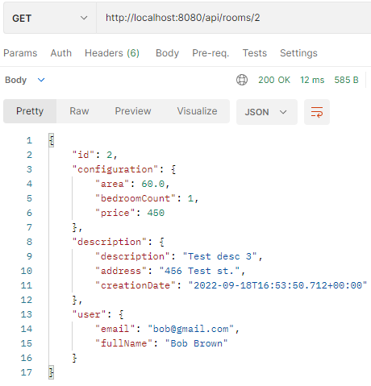
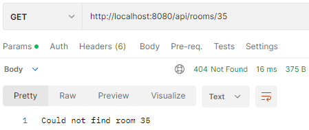

PUT /api/rooms/{id}

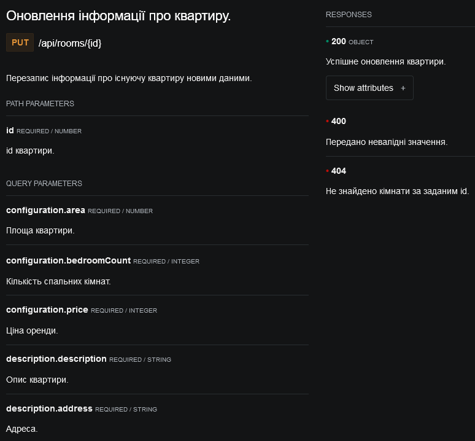
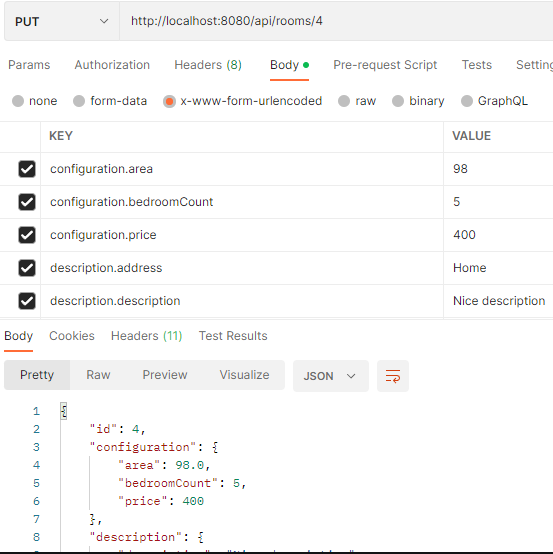
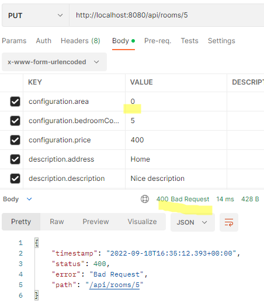
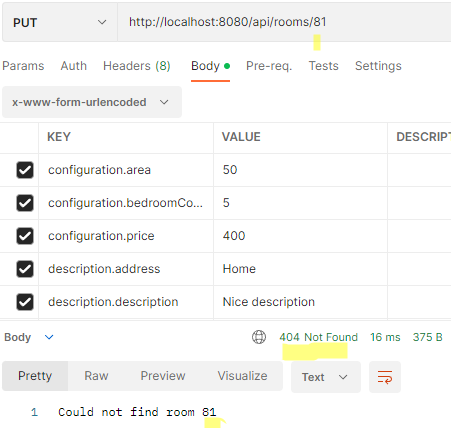

DELETE /api/rooms/{id}

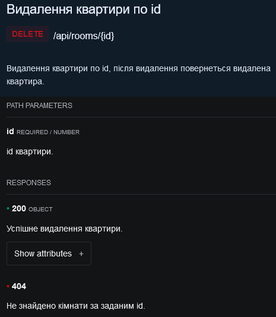
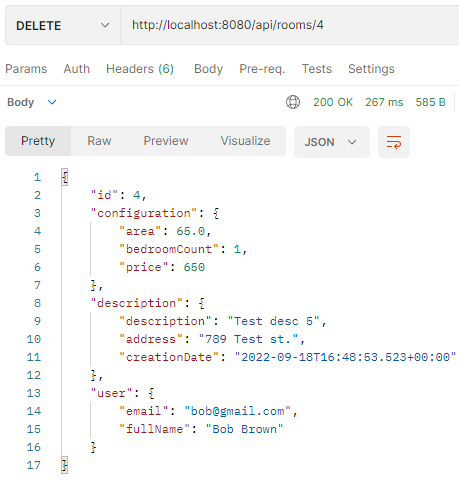
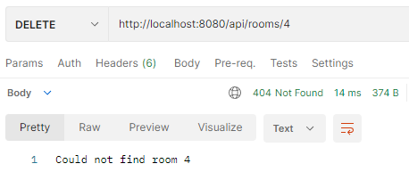

Контрольні питання:

1. Поясніть різницю між JDBC та JdbcTemplate.
   > ssdf
2. Які переваги надає PreparedStatement у порівнянні зі звичайним Statement?
   > ssdf
3. Поясніть різницю між методами execute(), executeQuery() та executeUpdate() класу PreparedStatement.
   > ssdf
4. Чим відрізняються інтерфейси RowMapper<T> та ResultSetExtractor<T>?
   > ssdf
5. Для чого потрібен інтерфейс KeyHolder?
   > ssdf
6. Як працює декларативне керування транзакціями у Spring Framework?
   > ssdf
7. Що таке «transaction propagation»? Як обрати потрібний механізм поширення транзакцій? Який механізм поширення транзакцій використовується за замовченням?
   > ssdf