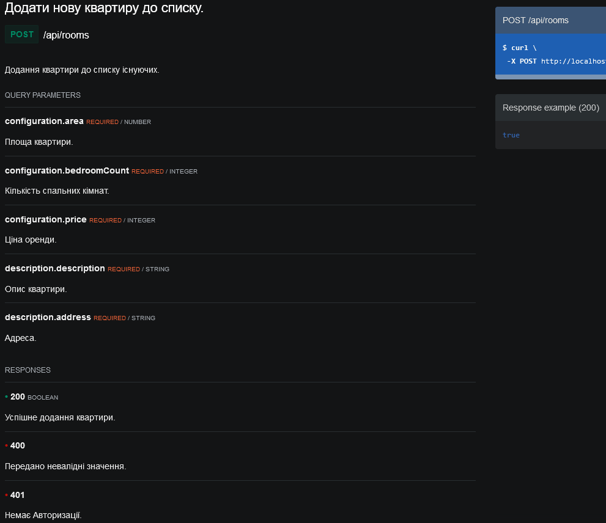

ЛР5

Роботу виконали студенти групи ІО-02:
- Воловик Олександр
- Литвиненко Данило
- Шумельчук Юрій

Варіант 16:
><b>Тема:</b> Оренда квартир
 <b>Сутності:</b> Квартира, параметри квартири, опис
 <b>Актори:</b> Хазяїн квартири, клієнт 
 <b>Сценарії використання:</b> 
 Хазяїн квартири: Створення/редагування/видалення інформації про квартиру
 Клієнт: пошук квартири по параметрам

Тестування розробленого API на відповідність опису у документації за допомогою Postman:

GET /api/orders

GET /api/rooms (Фільтрація по параметрах та пагінація)

POST /api/rooms

GET /api/rooms/{id}

PUT /api/rooms/{id}

DELETE /api/rooms/{id}

Контрольні питання:

1. Поясніть різницю між JDBC та JdbcTemplate.
   > <b>JDBC</b> - платформно-незалежний промисловий стандарт взаємодії Java-додатків з різними СУБД, реалізований у вигляді пакету java.sql, що входить до складу Java SE.   JDBC заснований на концепції так званих драйверів, що дозволяють отримувати з'єднання з базою даних спеціально описаним URL. Драйвери можуть завантажуватись динамічно (під час роботи програми).
   Завантажившись, драйвер сам реєструє себе і викликається автоматично, коли програма вимагає URL-адресу, що містить протокол, за який драйвер відповідає.
    <b>JDBCTemplate</b> - центральний клас у базовому пакеті JDBC. Він спрощує використання JDBC і допомагає уникнути типових помилок. Він виконує основний робочий процес JDBC, залишаючи коду програми надання SQL і отримання результатів. Цей клас виконує SQL-запити або оновлення, ініціюючи ітерацію над ResultSets і перехоплюючи винятки JDBC і переводячи їх у загальну, більш інформативну ієрархію винятків(exceptions), визначену в пакеті org.springframework.dao.
2. Які переваги надає PreparedStatement у порівнянні зі звичайним Statement?
   > Statement – використовується для виконання строкових запитів SQL.
    PreparedStatement - використовується для виконання параметризованих SQL-запитів. Крім виконання запиту цей клас дозволяє підготувати запит, відформатувати його належним чином.
    По-перше, PreparedStatement розширює інтерфейс Statement. Він має методи для прив'язки різних типів об'єктів, включаючи файли та масиви. Отже, код стає легким для розуміння.
    По-друге, він захищає від SQL-ін'єкцій, екрануючи текст для всіх наданих значень параметрів.
    PreparedStatement реалізує такі методи, як getMetadata() , які містять інформацію про результат, що повертається.
3. Поясніть різницю між методами execute(), executeQuery() та executeUpdate() класу PreparedStatement.
   > Метод <b>execute()</b>, Використовується для виконання оператора, який повертає кілька результуючих наборів, кілька лічильників оновлень або їхню комбінацію. Оскільки більшість програмістів ця розширена функція не потрібна Метод execute слід використовувати лише в тому випадку, якщо оператор може повернути декілька об'єктів ResultSet, кілька лічильників оновлень або комбінацію об'єктів ResultSet та лічильників оновлень.
    Метод <b>executeQuery</b> Оператор, який здійснює один набір результатів, такий як оператор SELECT. Найчастіше використовуваний метод виконання операторів SQL - executeQuery. Цей метод використовується для виконання оператора SELECT, який є оператором SQL.
    Метод <b>executeUpdate</b> Використовується для виконання операторів INSERT, UPDATE або DELETE та операторів SQL DDL (мова визначення даних), таких як CREATE TABLE та DROP TABLE. Результатом оператора INSERT, UPDATE чи DELETE є зміна однієї чи кількох із нуля чи кількох рядків у таблиці. Значення executeUpdate, що повертається, є цілим числом, що вказує кількість порушених рядків (тобто кількість оновлень). Для операторів, які не маніпулюють рядками, таких як CREATE TABLE або DROP TABLE, значення executeUpdate, що повертається, завжди дорівнює нулю.
4. Чим відрізняються інтерфейси RowMapper<T> та ResultSetExtractor<T>?
   > <b>RowMapper</b> зазвичай використовується для методів query() JdbcTemplate. Об’єкти RowMapper, як правило, не мають стану, тому їх можна використовувати повторно; вони є ідеальним вибором для реалізації логіки відображення рядків в одному місці.
    <b>ResultSetExtractor</b> в основному використовується в самій структурі JDBC. RowMapper зазвичай є простішим вибором для обробки ResultSet, відображаючи один об’єкт результату на рядок замість одного об’єкта результату для всього ResultSet.
5. Для чого потрібен інтерфейс KeyHolder?
   > Інтерфейс для отримання ключів, зазвичай використовується для автоматично згенерованих ключів, які потенційно повертаються операторами вставки JDBC.
    Реалізації цього інтерфейсу можуть містити будь-яку кількість ключів. У загальному випадку ключі повертаються як список, що містить одну карту для кожного рядка ключів.
    Більшість програм використовують лише один ключ на рядок і обробляють лише один рядок за раз у операторі вставки. У цих випадках просто викличте getKey або getKeyAs, щоб отримати ключ. Значення, яке повертає getKey, є числом, яке є звичайним типом для автоматично згенерованих ключів. Для будь-якого іншого типу автоматично згенерованого ключа використовуйте getKeyAs.
6. Як працює декларативне керування транзакціями у Spring Framework?
   > Декларативне управління транзакціями означає відділення управління транзакціями від бізнес-логіки. Розробник використовує лише анотації у конфігурації на основі XML для керування транзакціями.
    Spring створює proxy для класів, оголошених інструкцією @Transactional. Proxy у більшості випадків невидимий під час виконання. Він надає спосіб для Spring вводити поведінку “до”, “після” або “під час” викликів методів у proxy-об'єкт. Тому коли ми визначаємо метод з @Transactional, Spring динамічно створює proxy. Коли клієнти здійснюють виклики в наш об'єкт, виклики перехоплюються, а поведінка вводитиметься через механізм proxy.
    Spring сам собою транзакціями не управляє. Він є прошарком між вашим декларативним описом та кінцевою базою даних. Він делегує базі даних. Spring - це просто зручний для нас спосіб оголосити або "менеджити" транзакції, але всередині Spring не містить чогось такого, що можна було б назвати транзакцією.
7. Що таке «transaction propagation»? Як обрати потрібний механізм поширення транзакцій? Який механізм поширення транзакцій використовується за замовченням?
   > Що таке «transaction propagation»?
    Transaction propagation вказує, чи буде будь-який компонент або служба брати участь у транзакції чи ні, і як він поводитиметься, якщо викликаючий компонент/служба вже створив або не створив транзакцію.
    Transaction propagation визначає межі транзакцій нашої бізнес-логіки. Spring розпочинає та призупиняє транзакції відповідно до наших налаштувань поширення.
    Spring викликає TransactionManager::getTransaction, щоб отримати або створити транзакцію відповідно до propagation. Він підтримує деякі propagations для всіх типів TransactionManager, але є кілька з них, які підтримуються лише певними реалізаціями TransactionManager.
     Як обрати потрібний механізм поширення транзакцій?
    REQUIRED Propagation
    REQUIRED є поширенням за замовчуванням. Spring перевіряє, чи є активна транзакція, і якщо нічого не існує, створює нову. В іншому випадку бізнес-логіка додається до поточної активної транзакції.
    SUPPORTS Propagation
    Для SUPPORTS, Spring спочатку перевірить чи існує активна транзакція. Якщо так - тоді існуюча транзакція буде використана. Інакше - виконається без транзакції
    MANDATORY Propagation
    Коли поширення - MANDATORY, якщо є активна транзакція, вона буде використана. Якщо такої нема - Spring створить exception.
    NEVER Propagation
    Для поширення NEVER, Spring створить exception якщо існує активна транзакція.
    NOT_SUPPORTED Propagation
    Для NOT_SUPPORTED, якщо поточна транзакція існує, спочатку Spring призупинить її а потім виконає бізнес-логіку без транзакції.
    REQUIRES_NEW Propagation
    Якщо поширення - REQUIRES_NEW, то Spring призупинить поточну транзакції(якщо вона існує) та створить нову.
     Який механізм поширення транзакцій використовується за замовченням?
    REQUIRED Propagation використовується за замовченням.
